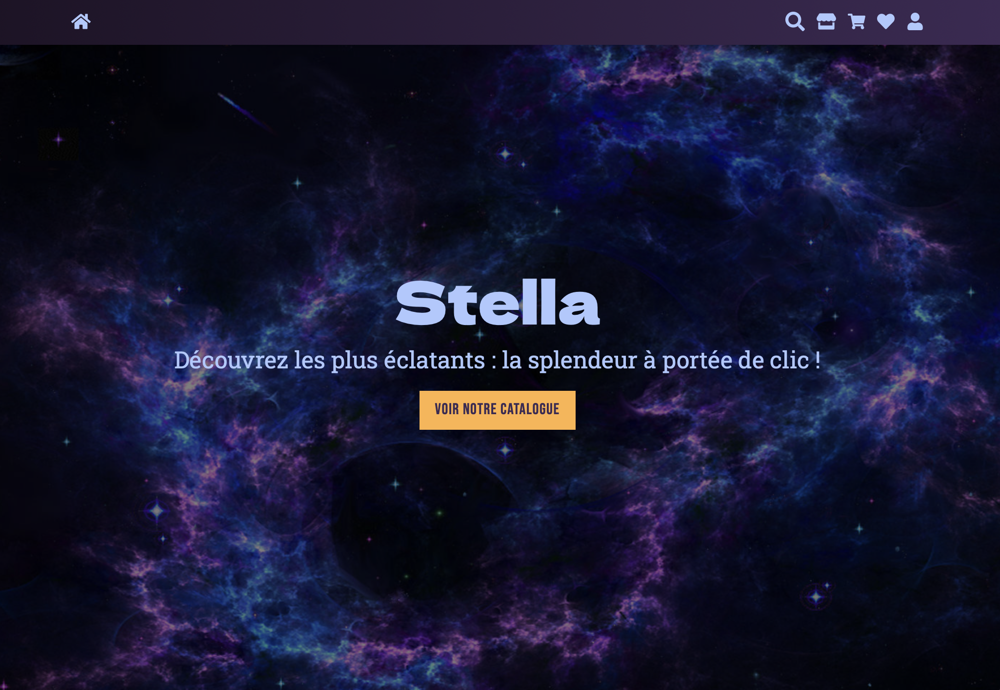
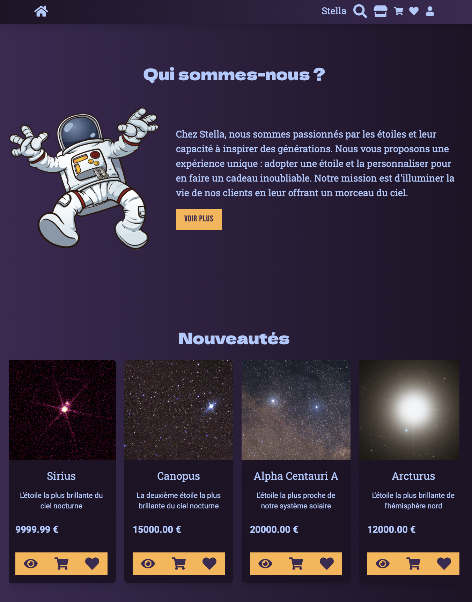
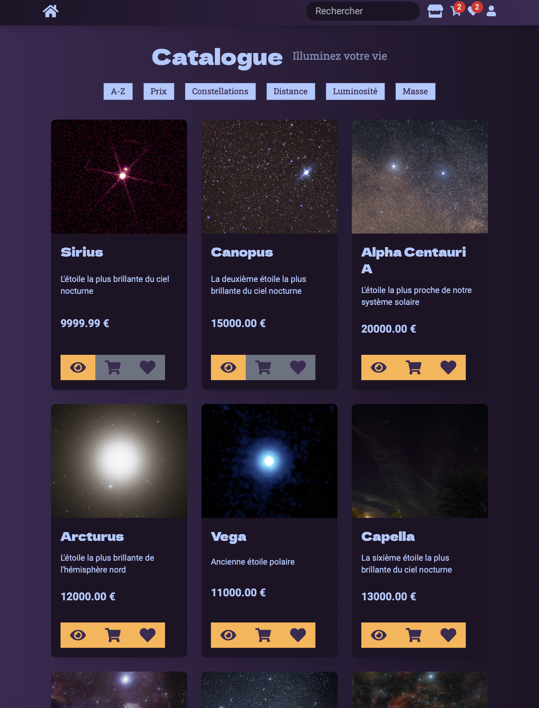
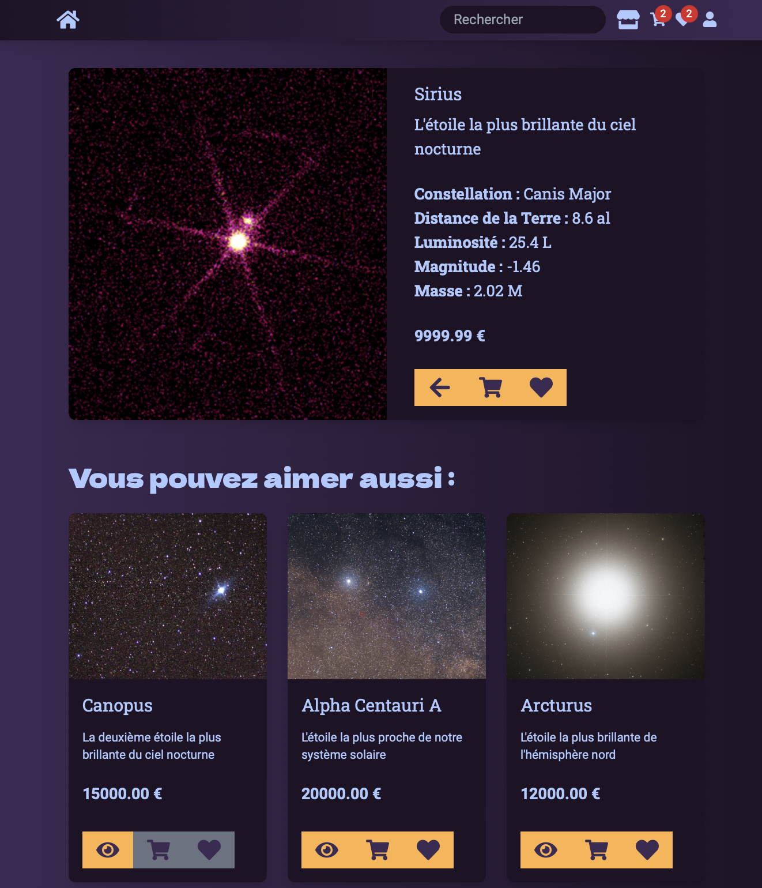
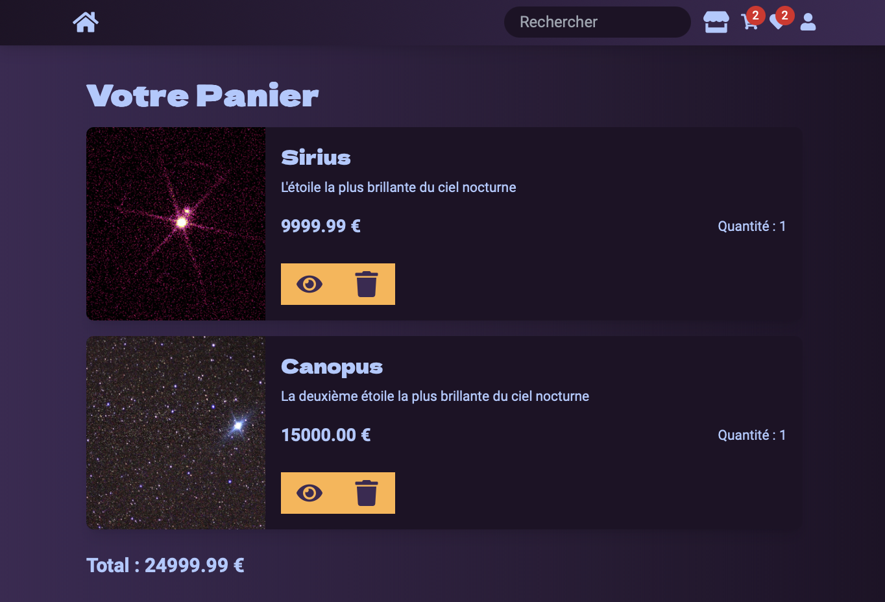
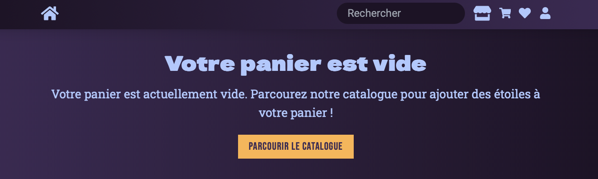
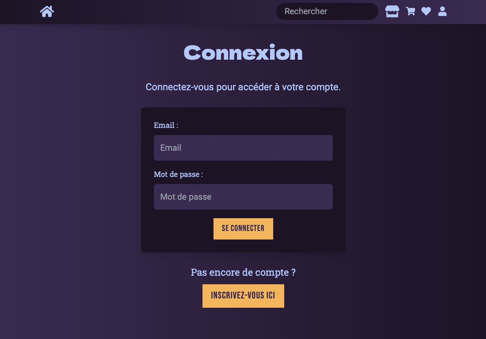
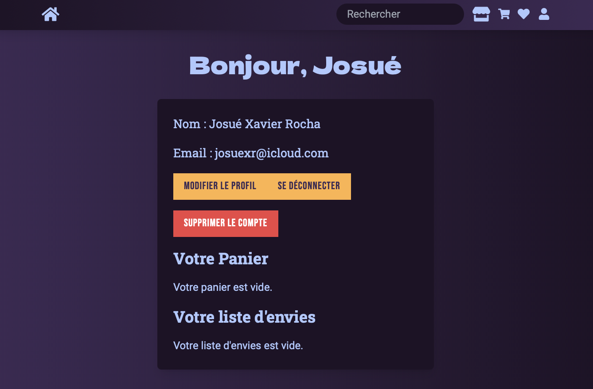

# Stella - E-commerce d'étoiles 🌟

Stella est une application e-commerce moderne permettant d'acheter des étoiles. Ce projet a été développé pour démontrer mes compétences en développement web full stack, en utilisant les technologies les plus récentes et les meilleures pratiques de l'industrie.

## Fonctionnalités

- Catalogue interactif d'étoiles avec filtres et recherche
- Authentification sécurisée des utilisateurs (JWT)
- Panier d'achat et liste des souhaits dynamiques
- API RESTful développée avec Express
- Interface utilisateur réactive grâce à React et TypeScript
- Base de données relationnelle optimisée avec PostgreSQL et Sequelize
- Linting et formatage automatiques avec Biome
- Design moderne avec Tailwind CSS

## Aperçu du projet

### Galerie d'Images

Voici quelques captures d'écran de l'application :



*Page d'accueil*



*Sections de la page d'accueil*



*Catalogue des étoiles*



*Détail d'une étoile*



*Panier d'achat*



*Panier d'achat vide*



*Page de connexion*



*Profile*

### Vidéo de Démonstration

Voici une vidéo de démonstration de l'application :

<video controls>
  <source src="./docs/screenshots/demo.m4v" type="video/mp4">
  Votre navigateur ne supporte pas la balise vidéo.
</video>

## Technologies utilisées

### Frontend

- React avec TypeScript pour une interface robuste et typée
- Tailwind CSS pour un design moderne et réactif
- React Router pour la navigation côté client
- Axios pour les requêtes HTTP

### Backend

- Node.js avec Express pour une API RESTful performante
- Sequelize comme ORM pour interagir avec PostgreSQL
- JSON Web Tokens (JWT) pour l'authentification et la sécurité
- Jest pour les tests unitaires et d'intégration

### Base de Données

- PostgreSQL pour une gestion efficace des données relationnelles
- MoCoDo pour la modélisation conceptuelle des données

### Outils et Pratiques

- Biome pour le linting et le formatage du code
- Git et GitHub pour le contrôle de version et la collaboration
- Canva et Excalidraw pour la conception visuelle
- Méthodologie MVC pour une architecture claire et maintenable

## Architecture

Le projet est structuré selon une architecture MVC (Modèle-Vue-Contrôleur) pour séparer les préoccupations et améliorer la maintenabilité.

```
stella-ecommerce/
├── client/          # Frontend React
│   └── src/
│       ├── components/
│       ├── pages/
│       ├── services/
│       ├── styles/
│       └── utils/
├── server/          # Backend Node.js
│   ├── controllers/
│   ├── models/
│   ├── routes/
│   ├── middlewares/
│   └── utils/
├── scripts/         # Scripts globaux
└── docs/            # Documentation

```

## Installation

### Prérequis

- Node.js (version 14 ou supérieure)
- npm ou yarn
- PostgreSQL (pour la base de données)

### Étapes

1. Clonez le dépôt
2. Installez les dépendances :
3. Configurez les variables d'environnement
- Copiez les fichiers .env.example dans les dossiers client/src/ et server/
- Renommez-les en .env
- Remplissez les variables nécessaires :
  - Dans client/src/.env, modifiez l'URL de l'API si nécessaire
  - Dans server/.env, configurez la base de données et la clé JWT
4. Initialiser la base des données

## Utilisation

- Démarrer le serveur : `cd server && npm run dev`
- Démarrer le client : `cd client && npm start`
- Exécuter les tests : `cd server && npm test`

## Scripts utiles

- Créer les tables : `npm run create-tables`
- Générer des données de test : `npm run generate-data`
- Réinitialiser la base de données : `npm run reset-db`

## Contribuer

Les contributions sont les bienvenues ! Pour contribuer au projet, voici les étapes :

1. **Fork** le dépôt
2. Créez une **branche** pour la fonctionnalité (`git checkout -b feature/AmazingFeature`)
3. **Commitez** les modifications (`git commit -m 'Ajout d'une fonctionnalité incroyable'`)
4. **Poussez** vers la branche (`git push origin feature/AmazingFeature`)
5. **Pull Request**

### Issues
Si il y a des problèmes ou des idées d'amélioration, go issues sur le dépôt. J'apprecie tous les retours et suggestions.

## Roadmap

Voici quelques fonctionnalités que je prévois d'ajouter :

- [ ] Terminer le formulaire de contact avec validation et envoi d'email
- [ ] Améliorer l'experience utilisateur, notament sur la page de profile et catalogue
- [ ] Intégration d'un système de paiement
- [ ] Implementer la gestions pour les commandes
- [ ] Tests tests tests tests...

## Licence

[Informations sur la licence à venir]